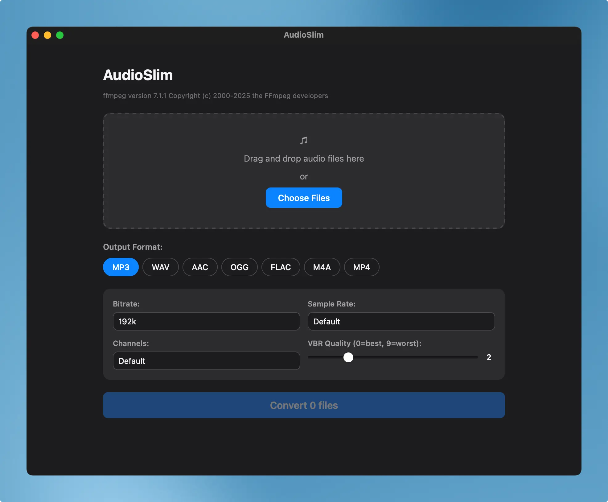

# AudioSlim

A desktop audio file converter and compressor built with Tauri, React, and TypeScript. Convert audio files between formats with configurable compression options powered by ffmpeg.

]

## Features

- Convert audio files between MP3, WAV, AAC, OGG, FLAC, M4A, and MP4 formats
- Configurable compression options: bitrate, sample rate, channels, and format-specific quality settings
- Drag-and-drop or file picker for selecting multiple files
- Real-time conversion progress with before/after file size comparison
- Cross-platform desktop application (macOS, Windows, Linux)
- Native performance with Rust backend

## Tech Stack

- **Frontend**: React 18 + TypeScript + Vite
- **Backend**: Tauri v2 (Rust)
- **Build Tool**: Vite 5
- **Package Manager**: pnpm
- **Audio Processing**: ffmpeg (system binary)
- **Plugins**:
  - `tauri-plugin-dialog` - Native file dialogs
  - `tauri-plugin-fs` - File system operations
  - `tauri-plugin-shell` - Shell command execution

## Prerequisites

Before you begin, ensure you have the following installed:

- [ffmpeg](https://ffmpeg.org/download.html) - must be available in your PATH
- [Node.js](https://nodejs.org/) (v18 or later)
- [pnpm](https://pnpm.io/) - `npm install -g pnpm`
- [Rust](https://www.rust-lang.org/tools/install)
- Platform-specific dependencies:
  - **macOS**: Xcode Command Line Tools
  - **Linux**: See [Tauri prerequisites](https://tauri.app/v2/guides/prerequisites/#linux)
  - **Windows**: Visual Studio C++ Build Tools

## Installation

1. Clone the repository:
   ```bash
   git clone https://github.com/gianpaj/audioslim.git
   cd audioslim
   ```

2. Install dependencies:
   ```bash
   pnpm install
   ```

## Development

Start the development server:

```bash
pnpm tauri dev
```

This will:
- Start the Vite dev server on `http://localhost:1420`
- Launch the Tauri application window
- Enable hot-reload for both frontend and backend changes

### Frontend Only

To run just the frontend without Tauri:

```bash
pnpm dev
```

## Building

Create a production build:

```bash
pnpm tauri build
```

The compiled application will be available in `src-tauri/target/release/bundle/`

## Usage

1. Launch the app with `pnpm tauri dev`
2. Drag and drop audio files onto the window, or click "Choose Files"
3. Select the desired output format (MP3, WAV, AAC, OGG, FLAC, M4A, MP4)
4. Adjust compression options (bitrate, sample rate, channels, quality)
5. Click "Convert" — output files are saved alongside the originals

### Supported Formats

| Format | Bitrate | Quality | Notes |
|--------|---------|---------|-------|
| MP3    | 64k-320k | VBR 0-9 | Most compatible |
| WAV    | -       | -       | Uncompressed |
| AAC    | 64k-320k | -     | Good quality/size ratio |
| OGG    | 64k-320k | -1 to 10 | Open source format |
| FLAC   | -       | 0-8     | Lossless compression |
| M4A    | 64k-320k | -     | Apple ecosystem |
| MP4    | 64k-320k | -     | Audio-only MP4 container |

## Project Structure

```
audioslim/
├── src/                    # React frontend source
│   ├── App.tsx            # Main app component
│   ├── main.tsx           # React entry point
│   ├── types.ts           # TypeScript types & format configs
│   └── components/        # UI components
│       ├── DropZone.tsx   # File selection (drag-drop + dialog)
│       ├── FormatSelector.tsx
│       ├── OptionsPanel.tsx
│       ├── FileList.tsx
│       └── ConvertButton.tsx
├── src-tauri/             # Rust backend
│   ├── src/
│   │   ├── main.rs        # Tauri application entry
│   │   └── lib.rs         # Audio conversion commands
│   ├── Cargo.toml         # Rust dependencies
│   ├── tauri.conf.json    # Tauri configuration
│   └── icons/             # Application icons
└── package.json           # Node dependencies & scripts
```

## Available Scripts

- `pnpm dev` - Start Vite dev server
- `pnpm build` - Build frontend (TypeScript compilation + Vite build)
- `pnpm preview` - Preview production build
- `pnpm tauri dev` - Start Tauri development mode
- `pnpm tauri build` - Build production application

## Configuration

- **Tauri Config**: `src-tauri/tauri.conf.json`
- **Vite Config**: `vite.config.ts`
- **TypeScript Config**: `tsconfig.json`
- **Rust Config**: `src-tauri/Cargo.toml`

## Recommended IDE Setup

- [VS Code](https://code.visualstudio.com/) with extensions:
  - [Tauri](https://marketplace.visualstudio.com/items?itemName=tauri-apps.tauri-vscode)
  - [rust-analyzer](https://marketplace.visualstudio.com/items?itemName=rust-lang.rust-analyzer)
  - [ESLint](https://marketplace.visualstudio.com/items?itemName=dbaeumer.vscode-eslint)
  - [Prettier](https://marketplace.visualstudio.com/items?itemName=esbenp.prettier-vscode)

## Contributing

Contributions are welcome! Please feel free to submit a Pull Request.

## Resources

- [Tauri Documentation](https://tauri.app/v2/guides/)
- [React Documentation](https://react.dev/)
- [Vite Documentation](https://vitejs.dev/)
- [TypeScript Documentation](https://www.typescriptlang.org/docs/)

## License

This project is open source and available under the [MIT License](LICENSE).
