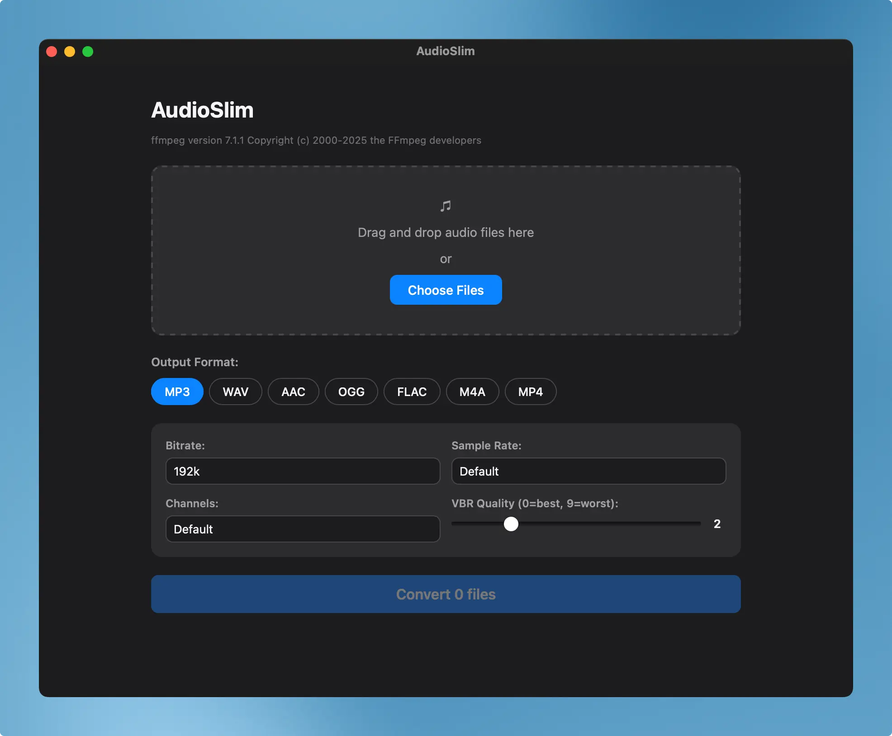

# AudioSlim

A desktop audio file converter and compressor built with [Electrobun](https://electrobun.dev/), React, and TypeScript. Convert audio files between formats with configurable compression options powered by FFmpeg.



## Features

- Convert audio files between MP3, WAV, AAC, OGG, FLAC, M4A, and MP4 formats
- Configurable compression options: bitrate, sample rate, channels, and format-specific quality settings
- Drag-and-drop or file picker for selecting multiple files
- Real-time conversion progress with before/after file size comparison
- Dark mode support
- FFmpeg bundled — no need to install it separately

## Install

### Homebrew (macOS arm64)

```bash
brew tap gianpaj/audioslim
brew install --cask audioslim
```

### Manual

Download the latest `.dmg` from [Releases](https://github.com/gianpaj/audioslim/releases), open it, and drag AudioSlim to Applications.

> **Note:** The app is not code-signed. If macOS blocks it, run:
> ```bash
> xattr -cr /Applications/audioslim.app
> ```

## Development

### Prerequisites

- [Bun](https://bun.sh/)

### Setup

```bash
bun install
```

### Run

```bash
# Without HMR
bun run start

# With HMR (recommended)
bun run dev:hmr
```

### Build

```bash
# Build for macOS arm64
bun run build:stable:macos-arm64
```

The compiled application and DMG will be in `artifacts/`.

## Tech Stack

- **Runtime**: [Electrobun](https://electrobun.dev/) (Bun + WKWebView)
- **Frontend**: React 18 + TypeScript + Vite + Tailwind CSS
- **Audio Processing**: FFmpeg (bundled)

## Project Structure

```
├── src/
│   ├── bun/
│   │   ├── index.ts           # Main process
│   │   └── converter.ts       # FFmpeg audio conversion
│   ├── mainview/
│   │   ├── App.tsx            # React app component
│   │   ├── main.tsx           # React entry point
│   │   ├── index.html         # HTML template
│   │   └── components/        # UI components
│   └── shared/
│       ├── rpc.ts             # RPC type definitions
│       └── types.ts           # Shared types & format configs
├── scripts/
│   └── prepare-ffmpeg.ts      # Bundle FFmpeg into the app
├── icon.iconset/              # macOS app icons
├── electrobun.config.ts       # Electrobun configuration
├── vite.config.ts             # Vite configuration
├── tailwind.config.js         # Tailwind configuration
└── package.json
```

## Supported Formats

| Format | Bitrate | Quality | Notes |
|--------|---------|---------|-------|
| MP3    | 64k-320k | VBR 0-9 | Most compatible |
| WAV    | -       | -       | Uncompressed |
| AAC    | 64k-320k | -     | Good quality/size ratio |
| OGG    | 64k-320k | -1 to 10 | Open source format |
| FLAC   | -       | 0-8     | Lossless compression |
| M4A    | 64k-320k | -     | Apple ecosystem |
| MP4    | 64k-320k | -     | Audio-only MP4 container |

## Contributing

Contributions are welcome! Please feel free to submit a Pull Request.

## License

This project is open source and available under the [MIT License](LICENSE).
